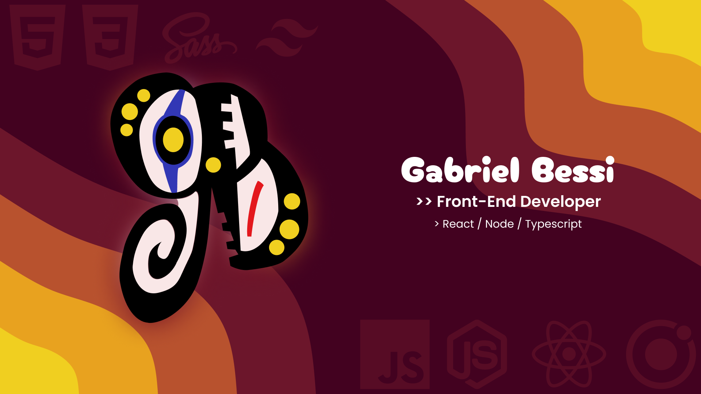

 <h2> Um pouco Sobre mim: </h2>

Sou Desenvolvedor há 2 anos, sou aluno de Desenvolvimento de Sistemas na Etec, Sou apaixonado por construir soluções paras ideias extraordinário. Eu trabalho com JavaScript / NodeJS / React / Ionic e outros tecnologias web. Sempre procuro me informar das novidades e amo aprender essas coisas, que é algo importante para ramo de programação que sempre tem algo novo para aprender.ヾ(⌐■_■)ノ♪

 
 

 
 
<h3> My skills:</h3>
   

  
Languages: 

  
   
  
  
   

   
   
   

  
DB: 

  
 
   
   

   
   
   

  
Frameworks: 

  
  
  
  
  
   

   
   
   

  
Others: 

  
  
   

   

 
<h3> Learning At The Moment:</h3>
  
  
  
  

 
 
<h3> I plan on learning:</h3>
 
 
 
 
 
  
 

 

  

 

  

 

 ##
 
  
 
  
  
   
   
<!--   -->
   

